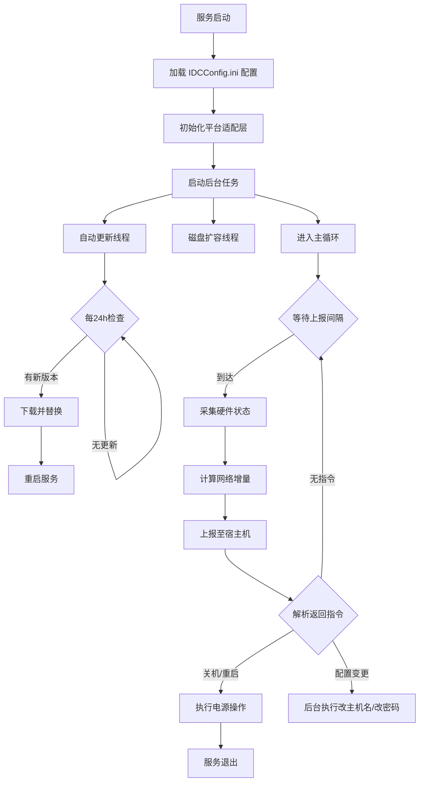

# CloudInit

OpenIDC 虚拟机初始化与状态上报服务。部署在虚拟机内部，负责定时采集硬件状态上报至宿主机，并接收宿主机下发的控制指令（关机/重启/改密/改主机名），同时支持磁盘自动扩容和服务自动更新。

## 功能特性

- **状态上报** - 定时采集 CPU/内存/磁盘/GPU/网络 等硬件状态，上报至宿主机
- **指令执行** - 接收宿主机下发的关机、重启、改密码、改主机名等控制指令
- **磁盘扩容** - 启动时自动检测并扩容根分区（支持 ext4/xfs/btrfs/APFS/NTFS）
- **自动更新** - 后台守护线程每24小时检查 GitHub Release，自动下载更新
- **多平台支持** - 通过平台抽象层适配 Linux / Windows / macOS
- **配置覆盖** - 支持 `IDCConfig.ini` 文件覆盖默认运行参数

## 执行流程



## 项目结构

```
CloudInit/
├── CloudInit.py            # 服务入口（主循环、信号处理、日志配置）
├── IDCConfig.ini           # 运行配置文件（可选，覆盖默认参数）
├── requirements.txt        # Python 依赖
├── CloudInit.spec          # PyInstaller 打包配置
├── CloudInit.bat           # Windows 打包脚本
│
├── CoreManage/             # 核心管理模块
│   ├── __init__.py
│   ├── CoreConfig.py       # 配置加载器（解析 IDCConfig.ini）
│   ├── CoreManage.py       # 虚拟机配置管理（改主机名/改密码，非阻塞）
│   ├── DiskExtend.py       # 磁盘扩容（非阻塞）
│   ├── PowerSetup.py       # 电源控制（关机/重启）
│   └── AutoUpdate.py       # 自动更新（后台守护线程）
│
├── OSPlatform/             # 平台抽象层
│   ├── __init__.py
│   ├── PlatformBase.py     # 抽象基类（定义平台操作接口）
│   ├── PlatformFactory.py  # 工厂方法（自动选择平台实现）
│   ├── PlatformLinux.py    # Linux 实现
│   ├── PlatformWindows.py  # Windows 实现
│   └── PlatformMacOS.py    # macOS 实现
│
├── NICManager/             # 网卡管理模块
│   ├── __init__.py
│   ├── NCManage.py         # 网卡扫描与管理
│   └── NCConfig.py         # 网卡配置数据模型
│
├── VMUploader/             # 状态采集模块
│   ├── __init__.py
│   ├── VMStatus.py         # 硬件状态采集器
│   ├── HWStatus.py         # 硬件状态数据模型
│   └── VMPowers.py         # 电源状态枚举
│
├── ServerInit/             # Linux 部署相关
│   ├── ServerInit.sh       # 一键部署脚本
│   ├── ServerInit.service  # systemd 服务单元文件
│   └── ServerInit          # 编译后的可执行文件
│
└── .github/workflows/      # CI/CD
    ├── build.yml           # 构建工作流
    └── release.yml         # 发布工作流
```

## 使用方式

### Linux 部署

```bash
# 1. 将 ServerInit 目录上传至目标虚拟机
# 2. 执行部署脚本（自动安装为 systemd 服务）
cd ServerInit
chmod +x ServerInit.sh
./ServerInit.sh
```

部署后服务自动启动，开机自启。管理命令：

```bash
systemctl status ServerInit   # 查看状态
systemctl restart ServerInit  # 重启服务
systemctl stop ServerInit     # 停止服务
journalctl -u ServerInit -f   # 查看日志
```

### Windows 部署

将编译后的 `CloudInit.exe` 放置到目标目录，注册为 Windows 服务或通过计划任务启动。

### 开发环境运行

```bash
pip install -r requirements.txt
python CloudInit.py
```

## 配置说明

创建 `IDCConfig.ini` 文件（与可执行文件同目录），可覆盖以下参数：

```ini
[server]
report_interval = 60          # 上报间隔（秒）
report_port = 1880            # 上报端口
report_path = /api/client/upload
report_host =                 # 固定上报地址（留空则自动推算）
gateway_offset = 2            # 网关偏移量

[update]
enabled = true                # 是否启用自动更新
interval = 86400              # 检查间隔（秒）
repo_url = https://api.github.com/repos/OpenIDCSTeam/CloudInit/releases/latest

[log]
level = INFO                  # 日志级别
retention = 7 days            # 日志保留时间
```

## 许可证

GPL-3.0 License
